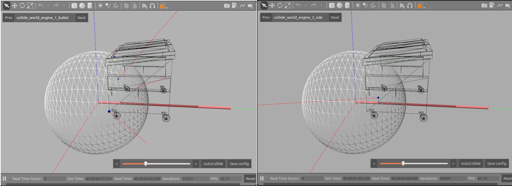

# collision-benchmark

Test framework for collision and physics engines.

You can find the documentation in the wiki pages of this repository.

## Physics engine testing

The main purpose of the framework is to test physics engines, not to just
run multiple worlds in parallel.
Several tests can be designed and implemented with the help of the API of
this testing framework. All tests that benefit from this framework
have one characteristing in common: They compare the behaviour of several
worlds. Typically, all worlds will therefore contain the same or equivalent
objects. The same world may for example be loaded with different physics
engines running them; or the same world may be loaded multiple times with
the same physics engine, but the shape representation varies between the
worlds, for example one world uses primitive shapes while the other world
replaces all primitive shapes by equivalent mesh representations.

The directory *test* contains source code for all testing related source code.

To build the tests, you need to do

``make tests``

To run all tests, type

``make test``

Running all the tests will also run the static tests (see below) which
has a lot of failures.
To run only a specific test instead, use the test executable directly by
running the executable, e.g.

``<your-build-dir>/world_interface_test``

To run only a specific test within a test set,
you may run the test with gtest parameter ``--gtest_filter``:

``<test executable> --gtest_filter=*<pattern in test name>*``

for example, to run ``WorldInterfaceTest.TransferWorldState``:

``<your-build-dir>/world_interface_test --gtest_filter=*TransferWorldState*``

In order to be able to visualize all shapes in gzclient, you
will need to have the directory
``<temp-path>/.gazebo/models``
in your ``GAZEBO_RESOURCE_PATH``, as described in the
[Installation](#installation) section.
This is required because the tests use generated mesh shapes
which have to be written to file (because SDF reads meshes from file).

### The "static tests"

The "static tests" comprise a number of tests in which the *dynamics
in the physics engine(s) are disabled*, meaning that the world(s) will not react
to the physics. However contact points between objects are still computed.
The static tests are therefore suitable for testing collision and
contact properties.

The static tests make use of the **gtest framework**.

The main method of testing implemented so far is the **"AABB intersection test"**
in which the axis-aligned bounding boxes of two objects are intersected in many
possible ways that they can intersect.
This generally leads to many states in which the objects are
colliding, and also states in which they are not (but in which they are
still close to each other).
Because this test uses two objects, we can refer to the test worlds as the
*"two objects world"*.

The test iterates through all AABB intersection states and sets
all worlds to the same state. It then compares the output of the worlds.
If the worlds disagree about the collision state, a failure is triggered.


*Image: An example where the engines disagree. Bullet detects a collision, but ODE doesnt'.*

*Info:* The two-objects-world is loaded multiple times, because states
of different worlds need to be compared. The multiple worlds loaded can
use the same, or different physics engines. Option (1): load the same
world multiple times with different physics engines, or Option (2): load
the world multiple times, each time with a different representation
of the objects (e.g. primitive *vs.* mesh) or Option (3): a combination of both.

**Running the tests**

The static tests can be run interactively or automated.
In interactive mode, the test will stop at each failure so you can inspect
it with gzclient. The default is automated mode, in which the failures are
printed and the test then contiues.

The test can also be set to save all the failure cases to *.world* files, which
can be opened for inspection at a later point.
However the default is to not write any files.

To run the test:

```
./static_test [--interactive] [--output <your-output-path>] [<gtest parameters>]
```

If you don't specify an output path, world files won't be written to file.

For example, to run only the particular test named *SpherePrimMesh*
(for other test names please refer to
 [test/Static_TEST.cc](test/Static_TEST.cc)),
run it in interactive mode, and save world files to */home/me/test/*:

```
./static_test --gtest_filter=*SpherePrimMesh* --interactive --output /home/me/test
```

In interactive mode, gzclient is loaded up as well
with the world switching GUI interface.
Then the shell prompts you to hit ``[Enter]``.

You should see the start state of the test. Before you start the test,
you may want to **enable the displaying of contacts**
(``View -> Contacts``), because once the test stops due to failure, the
simulation will be paused (and the contacts will only show once
the worlds are advanced again, so you won't see the contacts
until the next test failure).
It will also be helpful to **switch on wireframe rendering**
(``View -> Wireframe``)
to see the contacts better.

When you are ready, to start the test,
hit ``[Enter]`` in the terminal running the test and watch
the test.
If the test stops due to a failure, it will prompt you to hit
``[Enter]`` again to continue.
Before you continue, you may want to switch between
the worlds in gzclient and inspect the results and find the reason of failure.
Some information will also have been printed in the terminal about
the test failure details.

**Reminder:** When you display the test results which were saved to file
in gazebo later (ie. loading the saved *.world* file into gazebo directly),
don't forget to start gazebo in paused mode. This will allow the world to be
displayed in the state it was in when the test failed.
The tests also don't use a ground floor, which means the objects will
be falling in free space if you start gazebo with physics engine enabled and
in unpaused mode.
You will also need to add ``<your-output-path>`` to the ``GAZEBO_RESOURCE_PATH``
in order to be able to display models which contain meshes.

### The "two colliding shapes" test framework

Sometimes we need to see how contact points move when two colliding shapes
are moved just a little bit. Ideally, the contact points should be quite stable
in similar configurations of two colliding objects. But this may not always
be the case ("jumping contact points"). For testing and debugging cases in
which such contact point jumps happen, it is useful to have
a visual interface in which the shapes can be moved a small distance,
in the exact same way, over and over again around the point where the
contact jump happens.
For this purpose, the "two colliding shapes" test was developed.

This test only works with the physics engines integrated into Gazebo
and uses the Gazebo client for visualization.

Note that the dynamics engine is disabled, just as in the static tests, because
we want to obseve the contact points and not have the models react to
the collision.

**How the test works**

Two shapes are loaded, one at each end of a "collision bar". The collision
bar is the axis along which the objects will be moved to test the collision.
A **slider** can be used to move the objects step-wise towards and apart from each
other along the collision axis.
An **"Auto-collide"** function will move the objects along the collision
bar until at least one of the physics engines used for testing reports a
collision between the objects.


The models' **pose can be changed** relative to the collision axis in order
to find critical collision configurations which happen when the models collide.
To change the pose of the models, the Gazebo client transformation tools
can be used.
Alternatively the additional helper tools in the Gui overlay (the dial
and the translation buttons), which transform the model along the axis
perpendicular to the collision axis (this is only a test tool though, so not
more detail will be provided here).

A **configuration can be saved** an loaded again at a later point (to load,
use the command line argument ``-c <config-file>``).
The saved configuration will *not* save the amount the models were
moved via the axis slider or the auto-collide function, but only the amount
they were moved around by the user (via the Gazebo client transformation tools).
Before saving a configuration, it is advised to separate the models to the
maximum extent using the slider, to get a feeling of which configuration
will be saved. The configuration saved is the one at which the models are
separated to the full extent via the collision axis slider.

To load models, the test can use:

- SDF files which contain the model
- The name of the model (it has to be findable in ``GAZEBO_MODEL_PATH``)
- Unit shapes: Box, cylinder and sphere

However, only exactly two shapes are supported, regardless what type.

**Starting the test**

First, make sure that ``libcollision_benchmark_test_gui.so`` is in your
``GAZEBO_PLUGIN_PATH`` environment variable.

To start the test (which is part of the cmake ``tests`` target):

```
colliding_shapes_test <list of physics engines> -m <Model-1> -m <Model-2>``
```

the ``-m`` parameter specifies the model, either using *model names* or
*a file path* to the model SDF file.
Note that file paths have the limitation that when you save the configuration,
the absolute path will be saved, so you cannot use the configuration
file on another system.

*Example*

``colliding_shapes_test ode bullet -m coke_can -m beer``

Alternatively, to load a shape (unit sphere, box or cylinder),
use the ``-s`` parameter instead:

```
colliding_shapes_test <list of physics engines> -m <Model-1> -s <shape-name>``
```

where ``<shape-name>`` can be *sphere, cylinder* or *cube*.

You can specify the models in any order, the only limitation is that it has
to be exactly two models, regradless whether they are unit shapes or
models.

*Example*

``colliding_shapes_test ode bullet -m dumpster -s sphere``

The test will bring up Gazebo with the models you specified placed along
the collision axis.
It will use the "multiple worlds server" described earlier, each world
using one of the physics engines you specified.
You can switch between the worlds and see how the different engines interpret
the collision situation.


*Image: Difference between bullet and ODE*

You may want to set the wireframe view an enable contacts display in
Gazebo.

Try the "AutoCollide" function and the slider, then switch between the worlds
to see how they differ in their contact point calculation.

Try to move the shapes around with the Gazebo transformation
tools (top toolbar).

Note that the **collision axis cannot be moved**. It is not a model in the
world, it is only displayed as a helping visualization.

Things to try out:

- Using the slider
- Using the "AutoCollide" function
- Using the Gazebo client transform tools to change the models pose, then try
  slider and AutoCollide again
- Switch between worlds to see the differences
- Saving a configuration in which the model poses have been changed with the
  Gazebo transform tools.

**More implementation details**

How the test is loaded up:

1. The two models are loaded and placed *at the origin* (which means
   poses which they may have in the SDF files are ignored).
2. The two models are separated along the axis, such that their AABBs do not
   intersect. Model 2 is moved away from model 1 along the collision axis.
3. The slider or the "Auto Collide" function can be used to slide
   model 2 along the axis towards/away from model 1.
4. The models' pose can be changed and also saved to the configuration.

You can find the main part of the implementation in
[test/CollidingShapesTestFramework.hh](test/CollidingShapesTestFramework.hh).


## Short introduction to the collision_benchmark API

The API aims at subsuming several physics engine implementations under one common
interface. This way several physics engines operating under the same interface can be used
together and compared.

The main interface of the API can be found in
[PhysicsWorld.hh](collision_benchmark/PhysicsWorld.hh).
There are a few classes which provide different interfaces, each depending
on other template types. The main class which puts most
of the interfaces together is **PhysicsWorld**. However for accessing a world,
a pointer of only one of the interfaces may be required
(which does not depend on as many template parameters as PhysicsWorld).

There are the following abstract (pure virtual) interfaces which define different sets of
functionalities in relation to simulated worlds, all defined in
[PhysicsWorld.hh](collision_benchmark/PhysicsWorld.hh):

*   **PhysicsWorldBaseInterface** is the most basic interface which does not depend on template types.
    This interface is as independent of the underlying physics engine as possible. It provides the most
    basic functionality.
*   **PhysicsWorldStateInterface** is a very basic interface which only has
    one template type: the world state. So there can be several different
    physics engines operating under this interface -
    the only requirement is that they support the same *world state* type.
    The world state can be defined as a general data type which can be supported by many different engines.
    It is expected to contain all important information about the world.
    The idea is that there may be several different physics engines, all supporting the same world state.
    With this, states of the different worlds can be directly compared.
*   **PhysicsWorldModelInterface** is an interface which defines functions to access
    and load models in the world. The interface only requires to specify the ID of
    models used (e.g. a *std::string* to identify a model via its name),
    but not the actual data type for a model.
    Therefore, this interface is still fairly idependent of the physics engine, the only restriction being
    that all classes operating under this interface must support the same identifier types for models.
*   **PhysicsWorldContactInterface** is an interface which defines functions to access contact points.
*   **PhysicsWorldEngineInterface** adds a few functions which provide low-level access to the
    underlying implementation of the physics engine (e.g. retrieve shared pointers to specific model
    types) . This interface is highly dependent on the physics engine used.

There are two main abstract classes which combine the above interfaces into a common interface:

*   **PhysicsWorld** combines *PhysicsWorldBaseInterface*, *PhysicsWorldStateInterface*,
    *PhysicsWorldModelInterface* and *PhysicsWordlContactInterface*.
    It provides the base for all physics worlds with access to almost the entire functionality provided
    by the interfaces, except *PhysicsWorldEngineInterface* which is highly physics engine dependent.
*   **PhyicsEngineWorld** derives from *PhysicsWorld* and further implements *PhysicsWorldEngineInterface*.
    It is therefore very specific to the physics engine used.
    It requires the types of the classes for the models and the contact points and optionally, of
    the world class and of the class for a physics engine.
    This interface is mainly useful as a common superclass
    for the more specific implementations.
    It can be used to get low-level pointers to the actual world,
    model and contact types.

One full implementation of *PhysicsEngineWorld* is **GazeboPhysicsWorld**.

The main idea is that several implementations of the same template instantiation of *PhysicsWorld*
(which is still quite engine-independent) can be provided for different engines.
For example, all engines supported in Gazebo are automatically available via *GazeboPhysicsWorld*.
We may then add a new "brute-force" implementation of a physics engine which derives from the same *PhysicsWorld*
template instantiation as *GazeboPhysicsWorld* does. We can then directly compare contact points,
model states, and anything else in the *gazebo::physics::WorldState*
between the Gazebo implementation(s) and the brute-force implementation.
This can be useful for testing and debugging of the
physics engines already integrated into Gazebo, or to test new
engines which may be added to Gazebo.

The world interfaces define the access to the physics worlds themselves.
Beyond that, there are a few other classes worth mentioning here
which can be useful for managing several worlds at the same time.

* **MirrorWorld** is a world which can be set to mirror a *PhysicsWorld*.
  Because this is only a mirror to the other *original* world,
  manipulation of the original world is not be possible via this interface.
  It is only possible to view the original world in the mirror.
  The *MirrorWorld* can be useful for scenarios such as visualization of a
  world, where the mirror world is the one used for displaying the original
  world; the mirror can be switched to display a different world.
  An example implementation is the *GazeboTopicForwardingMirror* which redirects
  messages of all eligible topics in the original world to a designated target
  topic. The Gazebo Client *gzclient* may connect to this target topic.
  Behind the scenes it is then easy to change the mirror world to forward
  messages from another world, thereby allowing to easily switch between
  worlds to be displayed in the client.
* **WorldManager** can be used to maintain a number of worlds. The class
  provides functionality to access the same method in all worlds, for
  example to add the same model to all worlds.
  In addition to this, the WorldManager can maintain a MirrorWorld.
  It accepts a certain message type to control switching the world currently
  mirrored by the mirror world.
* **MultipleWorldsServer** provides a server which can be used to run one or
  more worlds with multiple physics engines. This class offers methods to
  make the use of multiple worlds easier, including the maintenance of a
  WorldManager and providing methods for loading, starting and stopping worlds.

## API tutorials

The tutorials are mainly documented in the given source files and only briefly described there. Please refer to the
mentioned source files for more information. All tutorials use the *GazeboPhysicsWorld* to demonstrate the use of
the interfaces with the Gazebo implementation.

To make the tutorials:

``make tutorials``

### Transfering a world state

The tutorial in the file [transfer_world_state.cc](tutorials/transfer_world_state.cc)
shows how to use the basic interface of **PhysicsWorldBase**.
It demonstartes how to load worlds form an SDF file and
set the worlds to a certain state. Two worlds will be loaded, then the state
from one is read, and the other world is set to the same state.

The first world is going to be the one which will be displayed with
*gzclient* (which always displays the first world that was loaded).
This will be the empty world to start with.
The second world will be loaded with the rubble world (*worlds/rubble.world*),
which is a world with quite a bit of movement in it, as you can watch the
rubble collapse.

Then, we want to see how we can use a *world state* to set the world to a
certain state.
To do this, we will first get the state of the rubble world, and set the
empty world to the same state after a number of iterations.
So while you are looking at the first world with gzclient, it should switch to
show the rubble world after a while.

From then on, at each iteration, we will set the first world to the state of
the second, so that the rubble moves just as in
the second world. The two world states should be identical at each loop.
The source code demonstrates how you can compare the
states to do sanity checks as well.

Start the tutorial:

``transfer_world_state``

You will receive a command line prompt when the tutorial is ready to start.
Then, in another terminal, load upgzclient:

``gzclient``

Ideally make sure you can see the both the first terminal and the Gazebo
GUI at the same time.

Then go back to the first terminal and press ``[Enter]`` to start the tutorial.

First, you will see the empty world for 1000 iterations.
Then, the rubble world should suddenly pop up, as the state of the world is
set to the rubble world state (a message like *"Now starting to set the world
to the rubble state"* should also be printed in the terminal)

Please refer to the code in
[transfer_world_state.cc](tutorials/transfer_world_state.cc),
which contains detailed documentation about how this is achieved.

### To come: More tutorials

**TODO: Add simple tutorials using MultipleWorldsServer and the WorldManager**
